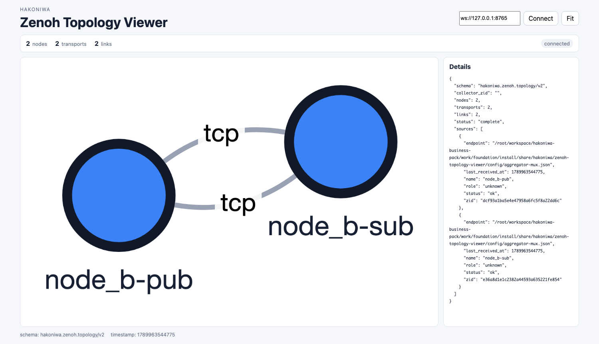
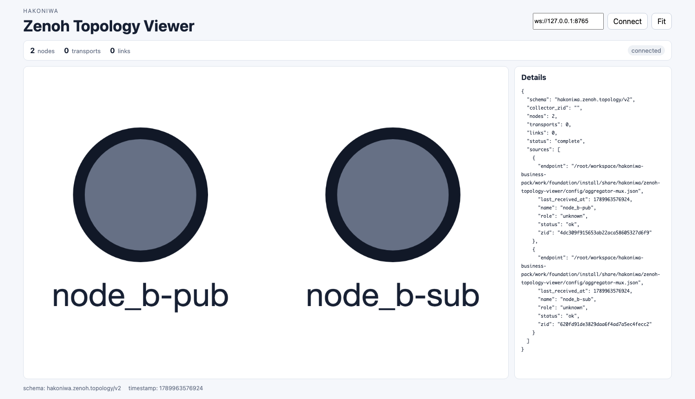
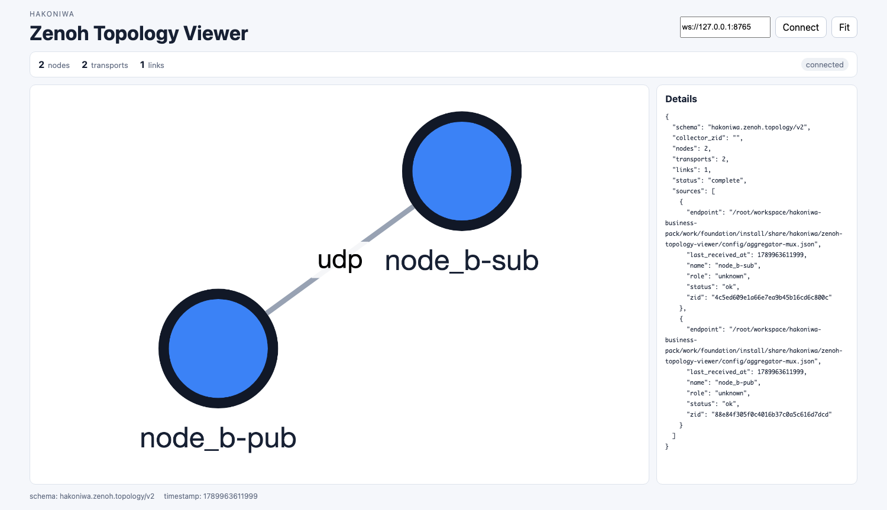

# 02 同一コンテナ内のPub/Sub

この章では、`node_b`内でPublisherとSubscriberを動かします。2つの端末を使用します。

Topology Viewerを併用する場合は、先に[第6章](06-viewer-setup.md)の準備と
Launcher起動を行ってください。各操作には通常版とViewer併用版のコマンドを
併記しています。以下の画面例はViewer併用版を実際に動かして取得したものです。

サンプルの既定値は次のとおりです。

- Publisherのkey expression: `demo/example/zenoh-c-pub`
- Subscriberのkey expression: `demo/example/**`
- payload: 1秒ごとに送られる文字列

Subscriberの `demo/example/**` は、Publisherの `demo/example/zenoh-c-pub` に一致します。

## 1. マルチキャスト探索を使う通信

### Subscriberの起動

端末Aで実行します。

```bash
docker exec -it node_b bash
```

```bash
cd /root/workspace
./sample/c-sample/cmake-build/sub -c sample/c-sample/config-multicast.json
```

Viewer併用時:

```bash
./sample/c-sample/cmake-build-viewer/sub \
  -A node_b-sub \
  -c sample/c-sample/config-multicast.json
```

### Publisherの起動

端末Bで実行します。

```bash
docker exec -it node_b bash
```

```bash
cd /root/workspace
./sample/c-sample/cmake-build/pub -c sample/c-sample/config-multicast.json
```

Viewer併用時:

```bash
./sample/c-sample/cmake-build-viewer/pub \
  -A node_b-pub \
  -c sample/c-sample/config-multicast.json
```

端末Aに次のような受信結果が繰り返し表示されれば成功です。

```text
>> [Subscriber] Received PUT ('demo/example/zenoh-c-pub': '[   0] Pub from C!')
```

### Viewerでの見え方



同じコンテナ内でも、PublisherとSubscriberは別々のZenoh sessionなので2ノードとして
表示されます。マルチキャストは相手の発見に使われ、発見後はTCPで接続します。
両Peerが互いに接続を開始するため、この実行例ではTCP linkが2本あります。

両方の端末で `Ctrl-C` を押して終了します。

### マルチキャストを無効にした場合

同じ手順で、両方の設定ファイルを `config-no-multicast.json` に変えて起動します。

端末A:

```bash
cd /root/workspace
./sample/c-sample/cmake-build/sub -c sample/c-sample/config-no-multicast.json
```

Viewer併用時:

```bash
./sample/c-sample/cmake-build-viewer/sub \
  -A node_b-sub \
  -c sample/c-sample/config-no-multicast.json
```

端末B:

```bash
cd /root/workspace
./sample/c-sample/cmake-build/pub -c sample/c-sample/config-no-multicast.json
```

Viewer併用時:

```bash
./sample/c-sample/cmake-build-viewer/pub \
  -A node_b-pub \
  -c sample/c-sample/config-no-multicast.json
```

明示的な接続先もなく、マルチキャスト探索も無効なため、Subscriberにはデータが届きません。

### Viewerでの見え方



2つのsession自体はAgentから報告されるため2ノードを確認できますが、相手を発見する
方法がないためtransportとlinkは0です。図で離れていることは、データが届かない
理由と対応しています。

確認後、両方の端末で `Ctrl-C` を押します。

## 2. UDPエンドポイントを明示する通信

この演習では、Subscriberが `172.30.0.11:7446` で待ち受け、Publisherがそこへ接続します。

端末AでSubscriberを先に起動します。

```bash
cd /root/workspace
./sample/c-sample/cmake-build/sub -c sample/c-sample/config-udp-listener.json
```

Viewer併用時:

```bash
./sample/c-sample/cmake-build-viewer/sub \
  -A node_b-sub \
  -c sample/c-sample/config-udp-listener.json
```

端末BでPublisherを起動します。

```bash
cd /root/workspace
./sample/c-sample/cmake-build/pub -c sample/c-sample/config-udp-connector.json
```

Viewer併用時:

```bash
./sample/c-sample/cmake-build-viewer/pub \
  -A node_b-pub \
  -c sample/c-sample/config-udp-connector.json
```

端末Aに受信結果が表示されれば成功です。

### Viewerでの見え方



明示したUDPエンドポイントで2つのsessionが接続され、1本のUDP linkとして表示されます。
線はデータ配送方向を表さないため、PublisherからSubscriberへの矢印にはなりません。

確認後、両方の端末で `Ctrl-C` を押します。

## 設定ファイルのポイント

- `config-multicast.json`: マルチキャスト探索を有効にする
- `config-no-multicast.json`: マルチキャスト探索を無効にする
- `config-udp-listener.json`: UDPエンドポイントで待ち受ける
- `config-udp-connector.json`: UDPエンドポイントへ接続する

設定ファイルは [`sample/c-sample`](../sample/c-sample/) にあります。

## Zenoh公式資料

- [Your first Zenoh app](https://zenoh.io/docs/getting-started/first-app/): PublisherとSubscriberによるPub/Subの基本
- [Abstractions](https://zenoh.io/docs/manual/abstractions/): Key、Key Expression、Publisher、Subscriberの定義
- [Deployment](https://zenoh.io/docs/getting-started/deployment/): Peer modeとマルチキャストScoutingの動作
- [Configuration](https://zenoh.io/docs/manual/configuration/): JSON5／YAML設定ファイルと設定項目の指定方法
- [Protocol Specification: Scouting](https://spec.zenoh.io/spec/1.0.0/scouting/): Scoutingによる発見とSession確立の関係

次は[03 同一ネットワーク内の通信](03-network.md)へ進みます。
