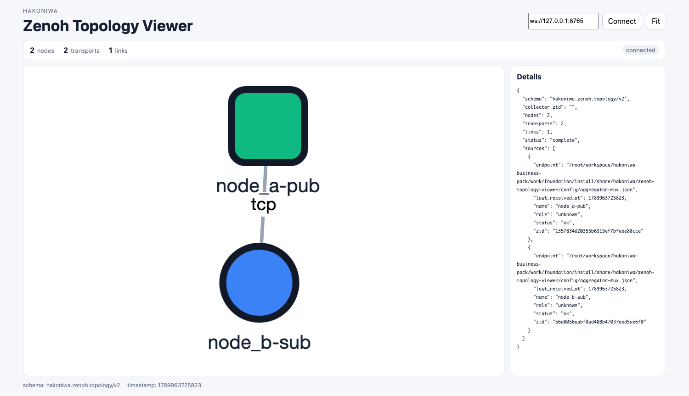
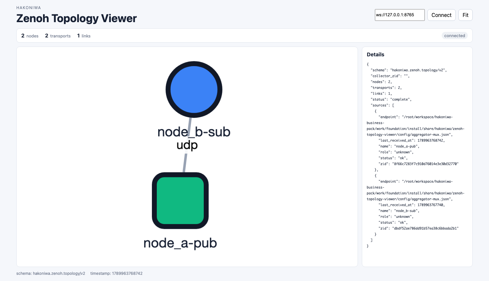
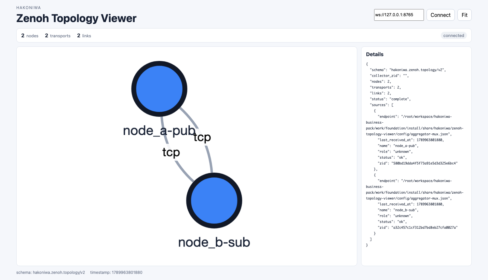

# 03 同一ネットワーク内の通信

この章では、同じ `local_net_1` に接続された `node_a` と `node_b` の間で通信します。

- `node_a`: `172.30.0.10`
- `node_b`: `172.30.0.11`

Topology Viewerを併用する場合は、先に[第6章](06-viewer-setup.md)の準備と
Launcher起動を行ってください。各操作には通常版とViewer併用版のコマンドを
併記しています。

## Zenohのmodeとネットワーク構成

Zenohの `peer`、`client`、`router` は、単なるプロセスの役割名ではありません。各Zenohノードがどのように他のノードを発見・接続し、どの通信モデルを構成するかを選択するmodeです。

- `peer` modeは、デフォルトではscoutingで到達可能なPeerを発見して自動接続します。Peer-to-Peer構成では、Peer同士が相互に直接接続する完全メッシュを形成します。
- `client` modeは、多数のPeerと相互接続せず、ある時点では1つのZenohノードとのsessionを維持します。接続先はscoutingで発見するほか、`-e` または `connect.endpoints` で候補を明示できます。
- `router` modeは、他のZenohノードに代わってデータを中継し、複数のネットワーク構成を接続できます。

したがって、接続数の増加を避けてスター型のネットワークへ集約したい場合は、アプリケーションを `client` modeにして共通の接続先を利用します。Peer直結とRouter経由の接続数の違いは、[04 Zenoh Routerを介した通信](04-router.md#3-peer直結とrouter経由のネットワーク接続構成)で詳しく確認します。

なお、`client`の接続先はRouterに限定されません。この章では、`node_a`のClientを`node_b`のPeerへ明示的に接続します。`-e`で指定するのはClientの接続先であり、Publisherがデータを送るSubscriberそのものではありません。PublisherとSubscriberの対応はkey expressionによって決まります。

2つの端末を使用します。Subscriberを先に起動してください。

## 1. TCP通信

### Subscriber

端末Aで `node_b` に接続し、TCPポート `7446` で待ち受けます。

```bash
docker exec -it node_b bash
```

```bash
cd /root/workspace
./sample/c-sample/cmake-build/sub --mode peer -l tcp/172.30.0.11:7446
```

Viewer併用時:

```bash
./sample/c-sample/cmake-build-viewer/sub \
  -A node_b-sub \
  --mode peer \
  -l tcp/172.30.0.11:7446
```

### Publisher

端末Bで `node_a` に接続し、`node_b` のTCPエンドポイントを指定します。

```bash
docker exec -it node_a bash
```

```bash
cd /root/workspace
./sample/c-sample/cmake-build/pub --mode client -e tcp/172.30.0.11:7446
```

Viewer併用時:

```bash
./sample/c-sample/cmake-build-viewer/pub \
  -A node_a-pub \
  --mode client \
  -e tcp/172.30.0.11:7446
```

端末Aに受信結果が表示されれば成功です。

### Viewerでの見え方



`node_a-pub`はclient、`node_b-sub`はpeerとして表示され、その間に明示した
1本のTCP linkがあります。図形の位置はコンテナやIPアドレスの位置を表しません。

確認後、両方の端末で `Ctrl-C` を押します。

## 2. UDP通信

### Subscriber

端末Aの `node_b` でUDPポート `7446` を待ち受けます。

```bash
cd /root/workspace
./sample/c-sample/cmake-build/sub --mode peer -l udp/172.30.0.11:7446
```

Viewer併用時:

```bash
./sample/c-sample/cmake-build-viewer/sub \
  -A node_b-sub \
  --mode peer \
  -l udp/172.30.0.11:7446
```

### Publisher

端末Bの `node_a` からUDPエンドポイントへ接続します。

```bash
cd /root/workspace
./sample/c-sample/cmake-build/pub --mode client -e udp/172.30.0.11:7446
```

Viewer併用時:

```bash
./sample/c-sample/cmake-build-viewer/pub \
  -A node_a-pub \
  --mode client \
  -e udp/172.30.0.11:7446
```

端末Aに受信結果が表示されれば成功です。

### Viewerでの見え方



TCPの場合と同じ2ノード間が、今度は1本のUDP linkで接続されています。プロトコルは
線の`udp`ラベルと、線をクリックしたときのDetailsで確認できます。

確認後、両方の端末で `Ctrl-C` を押します。

## 3. マルチキャスト探索で通信する

`node_a` と `node_b` は同一ネットワークにいるため、接続先を指定しなくてもマルチキャスト探索で相手を発見できます。

端末Aの `node_b`:

```bash
cd /root/workspace
./sample/c-sample/cmake-build/sub -c sample/c-sample/config-multicast.json
```

Viewer併用時:

```bash
./sample/c-sample/cmake-build-viewer/sub \
  -A node_b-sub \
  -c sample/c-sample/config-multicast.json
```

端末Bの `node_a`:

```bash
cd /root/workspace
./sample/c-sample/cmake-build/pub -c sample/c-sample/config-multicast.json
```

Viewer併用時:

```bash
./sample/c-sample/cmake-build-viewer/pub \
  -A node_a-pub \
  -c sample/c-sample/config-multicast.json
```

受信できることを確認します。

### Viewerでの見え方



マルチキャストで発見した2つのPeer間に、TCP linkが2本表示されています。これは
次節で説明するように、両Peerがそれぞれ相手への接続を開始した結果です。

確認後、両方の端末で `Ctrl-C` を押します。

### ViewerでTCP linkが2本見える理由

マルチキャストはPeerを発見するために使われ、発見後の通信にはTCP linkが
確立されます。Zenoh 1.10のPeer向け既定値では、マルチキャストで発見した
相手への `autoconnect_strategy` が `always` です。このため、相互到達可能な
2つのPeerがそれぞれ接続を開始し、同じPeer間にTCP linkが2本できる場合が
あります。

```text
Peer AがBを発見 -> AからBへTCP接続
Peer BがAを発見 -> BからAへTCP接続
```

どちらのTCP linkも双方向です。Publisher向け／Subscriber向けに1本ずつ、
という意味ではありません。ViewerのDetailsで `src_endpoint` と
`dst_endpoint` のポート番号の組が異なれば、別のTCP linkであることを確認できます。

重複接続を避けたい場合は、両Peerの `scouting.multicast` に次を設定すると、
ZIDの大小関係により一方だけが接続を開始します。

```json
"autoconnect_strategy": {
  "peer": {
    "to_router": "always",
    "to_peer": "greater-zid"
  }
}
```

ただし `greater-zid` は、NATなどにより片方向からしか接続できない構成には
適さない場合があります。この演習ではZenohの既定動作を観察するため、
`always`のままにしています。

## Zenoh公式資料

- [Deployment](https://zenoh.io/docs/getting-started/deployment/): Peer、Client、Routerの通信モデルと明示的なEndpoint接続
- [Configuration](https://zenoh.io/docs/manual/configuration/): `connect`、`listen`を含むZenoh設定の扱い
- [Protocol Specification: Scouting](https://spec.zenoh.io/spec/1.0.0/scouting/): UDPマルチキャストによるScoutingの仕様
- [Protocol Specification: Links](https://spec.zenoh.io/spec/1.0.0/transport/links.html): TCP、UDP Unicast、UDP Multicastのリンク特性

次は[04 Zenoh Routerを介した通信](04-router.md)へ進みます。
