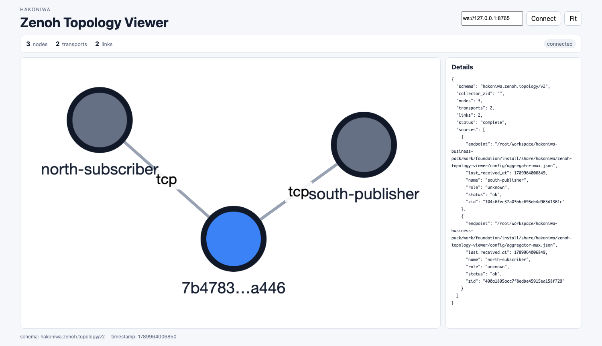

# 05 Regionsによるネットワークの階層化（発展）

この章では、Zenoh 1.9で導入されたRegionsを使い、従来のZenohネットワークを階層化します。

この章は発展編です。[04 Zenoh Routerを介した通信](04-router.md)まで完了してから取り組んでください。

## 1. この演習で確認すること

Regionsでは、Zenohネットワークを親子関係のある論理的な単位へ分割できます。各Regionは、従来からあるPeer-to-Peer、Brokered、Routedのいずれかの通信モデルで構成され、それぞれ `peer`、`client`、`router` modeを使用します。

Regionの階層は木構造です。

```text
              North Region（親）
                       |
                    Gateway
                       |
              South Region（子）
```

Gatewayは第4のZenoh modeではありません。通常のZenohプロセスが、1つのNorth Regionに参加しながら、1つ以上のSouth Regionとの境界を担当します。

### Gatewayを使うと何ができるか

Gatewayを使う目的は、Zenohネットワークを単に接続することだけではありません。
GatewayはSouth RegionをNorth Regionに対して代表し、Region境界の両側へ伝える
ネットワーク情報を集約します。

```text
North Region
  Gatewayだけを境界として扱う
       |
       | Region境界
       |
South Region
  複数のノード、内部Topology、Subscriber、Queryable
```

これにより、South Region内のノード数、内部Topology、個々のSubscriberや
Queryableなど、境界の反対側で不要な詳細をそのまま伝播させずに済みます。
North側の不要な詳細もSouth側から隠されるため、各ノードが保持・交換する
ネットワーク状態の増加を抑え、より大きなZenohシステムを構成しやすくなります。

`gateway.south.filters` は、この境界を構成するために、接続相手をどの
South Regionへ所属させるかを分類する設定です。名前に `filters` とありますが、
key expressionやPub/Subデータを通過・遮断するデータフィルターでも、単純な
接続許可リストでもありません。

- Southフィルターに一致した接続相手は、対応するSouth Regionへ分類される
- どのSouthにも一致せず、GatewayのNorth側とmodeが互換ならNorthへ分類される
- どのSouthにも一致せず、North側ともmodeが非互換なら接続を拒否される

Region境界を越えるPub/Subデータは、key expressionに基づいてGatewayが中継します。
North／Southはデータの許可方向を意味しないため、この演習では両方向の配送を
確認します。アクセス制御やkey expression単位の通過制限が必要な場合は、
Regionsの分類とは別の機能として設計します。

## 2. North／Southの分類方法

Gatewayの設定には `gateway.south` があり、接続相手をSouth Regionへ分類するフィルターを記述します。明示的な `gateway.north` フィルターはありません。

接続相手は、次の順序で分類されます。

```text
接続してきたZenohプロセス
          |
          v
gateway.southのフィルターに一致するか
          |
     +----+----+
     |         |
   一致       不一致
     |         |
     v         v
対応する     North側とmodeが
South Region  互換であるか
               |
          +----+----+
          |         |
        互換       非互換
          |         |
          v         v
       North      接続拒否
```

フィルターでは、接続相手の次の情報を利用できます。

- `region_names`: 接続相手が提示したRegion属性
- `modes`: Client、Peer、Routerのmode
- `zids`: Zenoh ID
- `interfaces`: 接続を受けたネットワークインターフェース

### region_nameについて

`region_name` は、そのZenohノードのNorth Regionを識別するための任意の名前です。接続先のGatewayは、この値を `gateway.south` の分類条件として利用できます。

ただし、`region_name` はグローバルに登録されるRegion IDではなく、Gateway自身の `region_name` と自動的に比較されるものでもありません。最終的なNorth／Southの分類は、Gatewayの `gateway.south` フィルターとmodeの互換性によって決まります。

この演習では、次のように使用します。

```text
region_name = classroom-south
          |
          v
GatewayのSouthフィルターに一致
          |
          v
South Regionとして分類
```

一方、`classroom-north` という名前がGateway自身の名前と一致したからNorthになるわけではありません。Southフィルターに一致せず、modeがNorth側と互換であるためNorthになります。

### modeの互換性

ここでいう「modeが互換」とは、単に2つのmode名が同じかを
比較することではありません。Gatewayが接続相手をSouthに分類したか、
そして相手がGatewayをどちら側と判定するかを、接続確立時に
組み合わせて決定します。したがって、この判定には向きがあります。

この演習では、Gatewayだけが `gateway.south` を明示設定し、
node_bとnode_cは既定の `"auto"` を使います。この条件で、
相手がSouthフィルターに一致しなかった場合の結果は次の通りです。

| Gatewayのmode | 相手が `router` | 相手が `peer` | 相手が `client` |
| --- | --- | --- | --- |
| `router` | Northとして接続 | 接続拒否 | 接続拒否 |
| `peer` | Northとして接続 | Northとして接続 | 接続拒否 |
| `client` | Northとして接続 | Northとして接続 | 接続拒否 |

この表のNorthは、Gatewayから見た接続相手の位置です。
例えば `client` Gatewayが `router` または `peer` をNorthとして
接続する場合、Gateway自身はBrokered Regionの `client` として動作し、
North側の相手がその接続のBrokerになります。

例えば、この演習のGatewayは `peer` です。Southフィルターに
一致しない `peer` であるnode_bは、表の `peer` と `peer` の
組み合わせに従い、Northとして接続されます。

一方、相手がSouthフィルターに一致した場合は、次の通りです。

| Gatewayのmode | 相手が `router` | 相手が `peer` | 相手が `client` |
| --- | --- | --- | --- |
| `router` | Southとして接続 | Southとして接続 | Southとして接続 |
| `peer` | 接続拒否 | Southとして接続 | Southとして接続 |
| `client` | 接続拒否 | Southとして接続 | Southとして接続 |

`router` をSouthに置けるのが `router` Gatewayだけなのは、
Routed RegionをSouth Regionにできるのは、North側もRouted Regionの
場合だけというRegionsの制約によるものです。

なお、両方のノードが `gateway.south` を明示設定した場合は、
modeの組み合わせだけでは決まりません。両方が相手をNorthとした場合は
同modeだけが接続でき、両方が相手をSouthとした場合は矛盾として
拒否されます。片方がNorth、もう片方がSouthとした場合に、
上記のRouted Regionの制約を満たせば親子関係が成立します。

### 接続可否とTopologyは別の話

上の表が示すのは、その2プロセス間のZenoh sessionを確立できるかと、
接続相手をNorth／Southのどちらに分類するかです。
`Northとして接続` は「Router経由に変更する」という意味ではありません。
また、`接続拒否` は「Peer間のメッシュ通信に切り替える」という意味でも
ありません。その組み合わせではsessionが成立しないため、別の有効な
接続経路がなければ通信できません。

session成立後の通信Topologyは、そのsessionが参加するRegionの
通信モデルで決まります。

| 通信モデル | Region内のノード | Topology | データの流れ |
| --- | --- | --- | --- |
| Routed | `router` | Router間のmeshを構成できる | Routerがroutingする |
| Peer-to-Peer | `peer` | 全Peerが直接接続するclique | Peer間の直接sessionを使う |
| Brokered | `client` | ClientがBrokerに接続するstar | Brokerを経由する |
| Region境界 | GatewayとNorth／Southのノード | Regionの親子関係 | Gatewayが境界を越えて中継する |

したがって、同じNorth Regionとして接続された `router` 同士なら
Routed Region、`peer` 同士ならPeer-to-Peer Regionになります。
`client` とNorth側のBrokerの間はBrokered Regionの接続です。
GatewayがNorthとSouthをつなぐ場合は、
両側を1つのmeshへ合併するのではなく、それぞれのRegion内Topologyを
保ったままGatewayが境界を越えて中継します。

この演習では、node_aとnode_bはNorth側のPeer-to-Peer Regionで
直接接続します。node_cはSouth側に分類されるため、node_bと
同じcliqueには入らず、node_aをGatewayとして通信します。

```text
node_b (North peer) --- node_a (peer Gateway) --- node_c (South peer)
       Peer直接session          Region境界のsession
```

## 3. 演習環境

この演習では、Dockerのネットワーク構成とRegionを次のように対応させます。

```text
local_net_1 / North Region

  node_a: Gateway   mode=peer
  node_b: Pub/Sub   mode=peer
                 |
              node_r
                 |
local_net_2 / South Region

  node_c: Pub/Sub   mode=peer
```

すべてのZenohプロセスを `peer` に統一します。これにより、node_bとnode_cのNorth／Southの違いがmodeの違いではなく、Gatewayのフィルターによって生じることを確認できます。

使用する設定ファイルは次の3つです。

| ファイル | 実行場所 | 役割 |
| --- | --- | --- |
| `config-region-gateway.json5` | node_a | Gateway。`classroom-south` をSouthに分類する |
| `config-region-north.json5` | node_b | Southフィルターに一致しないPeer |
| `config-region-south.json5` | node_c | `classroom-south` を提示するPeer |

### 3つの設定ファイルの読み方

#### Gateway: `config-region-gateway.json5`

```json5
{
  mode: "peer",
  region_name: "classroom-north",
  listen: {
    endpoints: ["tcp/172.30.0.10:7446"],
  },
  scouting: {
    multicast: {
      enabled: false,
    },
  },
  gateway: {
    south: [
      {
        filters: [
          {
            region_names: ["classroom-south"],
          },
        ],
      },
    ],
  },
}
```

| 設定 | この演習での意味 |
| --- | --- |
| `mode: "peer"` | GatewayはNorth RegionにPeerとして参加する |
| `region_name: "classroom-north"` | Gateway自身が提示するNorth Region名 |
| `listen.endpoints` | North／South双方のPeerからsession接続を受けるTCP Endpoint |
| `scouting.multicast.enabled: false` | 自動探索を使わず、明示Endpointだけで接続構成を作る |
| `gateway.south` | Gatewayが担当するSouth Regionの定義を並べる配列 |
| `filters` | そのSouth Regionへ接続相手を分類する条件 |
| `region_names: ["classroom-south"]` | このRegion名を提示した接続相手をSouthへ分類する |

`gateway.south` の配列要素1つが、1つのSouth Regionを表します。この例には
要素が1つしかないため、Gatewayが担当するSouth Regionも1つです。

```text
gateway.south[0]
  = 1つ目のSouth Region

gateway.south[0].filters
  = そのSouth Regionへ分類する条件群
```

`filters` に複数のフィルターオブジェクトがある場合は、いずれか1つに一致すれば
そのSouth Regionに分類されます。1つのフィルター内に `modes`、`zids`、
`interfaces`、`region_names`など複数の条件がある場合は、すべての条件への
一致が必要です。

#### North側Peer: `config-region-north.json5`

```json5
{
  mode: "peer",
  region_name: "classroom-north",
  connect: {
    endpoints: ["tcp/172.30.0.10:7446"],
  },
  scouting: {
    multicast: {
      enabled: false,
    },
  },
}
```

`node_b` は `classroom-north` を提示し、GatewayのEndpointへ明示接続します。
この名前はSouthフィルターの `classroom-south` に一致しません。一方、
`mode=peer` はGatewayのNorth側の通信モデルと互換なので、North Regionへ
分類されます。

#### South側Peer: `config-region-south.json5`

```json5
{
  mode: "peer",
  region_name: "classroom-south",
  connect: {
    endpoints: ["tcp/172.30.0.10:7446"],
  },
  scouting: {
    multicast: {
      enabled: false,
    },
  },
}
```

`node_c` も `mode=peer` で同じGateway Endpointへ明示接続します。ただし、
`classroom-south` がGatewayのSouthフィルターに一致するため、South Regionへ
分類されます。

North側とSouth側の設定差は、この演習では `region_name` だけです。物理ネットワークや
接続先Endpointではなく、Gatewayが接続時に受け取った属性でRegionを分類できることを
確認するため、このような設定にしています。

Topology Viewerを併用する場合は、先に[第6章](06-viewer-setup.md)の準備と
Launcher起動を行ってください。各Pub/Subには通常版とViewer併用版のコマンドを
併記しています。Gatewayとして起動する`zenohd`のコマンドは通常版と共通です。

## 4. Gatewayを起動する

端末Aで `node_a` に接続します。

```bash
docker exec -it node_a bash
```

Gateway設定を確認します。

```bash
cd /root/workspace
sed -n '1,200p' sample/c-sample/config-region-gateway.json5
```

`zenohd` をGatewayとして起動します。

```bash
zenohd -c sample/c-sample/config-region-gateway.json5
```

起動に成功すると、Gatewayの待受Endpointが表示されます。

```text
zenohd v1.10.1 built with rustc ...
Zenoh can be reached at: tcp/172.30.0.10:7446
```

`Zenoh can be reached at` は、GatewayがNorth側の `node_a` で待受を開始し、
North／SouthのPeerからsession接続を受け付けられる状態になったことを示します。

このGatewayは `mode=peer` で、TCPの `172.30.0.10:7446` を待ち受けます。接続相手の `region_name` が `classroom-south` の場合、その接続を1つ目のSouth Regionへ分類します。

## 5. SouthからNorthへのPub/Sub

最初に、South側からNorth側へデータを送ります。

### North側Subscriber

端末Bで `node_b` に接続します。

```bash
docker exec -it node_b bash
```

```bash
cd /root/workspace
./sample/c-sample/cmake-build/sub -c sample/c-sample/config-region-north.json5
```

Viewer併用時:

```bash
./sample/c-sample/cmake-build-viewer/sub \
  -A north-subscriber \
  -c sample/c-sample/config-region-north.json5
```

node_bはSouthフィルターに一致せず、Gatewayと同じ `peer` なのでNorthとして扱われます。

### South側Publisher

端末Cで `node_c` に接続します。

```bash
docker exec -it node_c bash
```

```bash
cd /root/workspace
./sample/c-sample/cmake-build/pub -c sample/c-sample/config-region-south.json5 \
  -p "Pub from South!"
```

Viewer併用時:

```bash
./sample/c-sample/cmake-build-viewer/pub \
  -A south-publisher \
  -c sample/c-sample/config-region-south.json5 \
  -p "Pub from South!"
```

node_cは `region_name=classroom-south` がGatewayのSouthフィルターに一致するため、Southとして扱われます。

端末BのNorth側Subscriberに、South側Publisherからの受信結果が表示されることを確認します。

```text
Opening session...
Declaring Subscriber on 'demo/example/**'...
Press CTRL-C to quit...
>> [Subscriber] Received PUT ('demo/example/zenoh-c-pub': '[   0] Pub from South!')
>> [Subscriber] Received PUT ('demo/example/zenoh-c-pub': '[   1] Pub from South!')
>> [Subscriber] Received PUT ('demo/example/zenoh-c-pub': '[   2] Pub from South!')
```

`Pub from South!` がNorth側で受信されることは、`classroom-south` に分類された
node_cから、Gatewayを越えてNorth側のnode_bへデータを配送できたことを示します。

### Viewerでの見え方



North側とSouth側のPeerは直接接続せず、中央のGatewayへ1本ずつTCP linkを
確立しています。中央のGatewayは`zenohd`として起動していてTopology Agentを
attachしていないため、表示名ではなく短縮ZIDがラベルになります。

Viewerの線はRegion階層やデータ配送方向を表しません。この図は、2つのPeerが
同じGatewayへ接続している物理的なsession構成を示します。

確認後、PublisherとSubscriberをそれぞれ `Ctrl-C` で停止します。Gatewayは起動したままにします。

## 6. NorthからSouthへのPub/Sub

次にPublisherとSubscriberの役割を入れ替え、データが逆方向にも流れることを確認します。

端末Cの `node_c` でSouth側Subscriberを起動します。

```bash
cd /root/workspace
./sample/c-sample/cmake-build/sub -c sample/c-sample/config-region-south.json5
```

Viewer併用時:

```bash
./sample/c-sample/cmake-build-viewer/sub \
  -A south-subscriber \
  -c sample/c-sample/config-region-south.json5
```

端末Bの `node_b` でNorth側Publisherを起動します。

```bash
cd /root/workspace
./sample/c-sample/cmake-build/pub -c sample/c-sample/config-region-north.json5 \
  -p "Pub from North!"
```

Viewer併用時:

```bash
./sample/c-sample/cmake-build-viewer/pub \
  -A north-publisher \
  -c sample/c-sample/config-region-north.json5 \
  -p "Pub from North!"
```

端末CのSouth側Subscriberに、North側Publisherからの受信結果が表示されることを確認します。

```text
Opening session...
Declaring Subscriber on 'demo/example/**'...
Press CTRL-C to quit...
>> [Subscriber] Received PUT ('demo/example/zenoh-c-pub': '[   0] Pub from North!')
>> [Subscriber] Received PUT ('demo/example/zenoh-c-pub': '[   1] Pub from North!')
>> [Subscriber] Received PUT ('demo/example/zenoh-c-pub': '[   2] Pub from North!')
```

`Pub from North!` がSouth側で受信されることは、North／SouthがRegion階層上の
親子関係であり、データの流れる方向を制限しないことを示します。

PublisherとSubscriberを入れ替えてもsession構成は変わらないため、Viewerには
上と同じ3ノード、2 linkの図が表示されます。

確認後、Publisher、Subscriber、Gatewayの順に、それぞれの端末で `Ctrl-C` を押します。

## 7. この演習から分かること

- Gatewayは専用のmodeではなく、通常のZenohプロセスにGateway設定を加えたもの
- `gateway.south` に一致した接続は対応するSouth Regionへ分類される
- Southに一致しない接続は、North側とmodeが互換ならNorthへ分類される
- `region_name` の一致だけでNorth所属が決まるわけではない
- 同じmodeでも、Gatewayの分類によって異なるRegionとして扱える
- North／Southの境界を越えたPub/Subは双方向に行える
- `pub.c` と `sub.c` のPub/Sub処理は変更せず、セッション設定だけで階層化できる

`gateway.south` の既定値は `"auto"` です。`"auto"` は従来のRouter、Peer、Clientの階層と同等になるように接続を分類します。そのため、Regionsを明示的に設定しない従来構成も引き続き動作します。

## 8. 制約と注意点

- Region階層は木構造にする必要があります
- 1つのRegionが持てるNorth Regionは最大1つです
- 1つのGatewayは複数のSouth Regionを担当できます
- 同じSouth Regionに複数のGatewayを配置できますが、それらは同じNorth Regionに所属する必要があります
- 複数Gatewayで同じRegion境界を構成する場合、分類規則の整合性を運用側で管理する必要があります
- Routed RegionをSouthに配置できるのは、North側もRouted Regionの場合です

## Zenoh公式資料

- [Deployment](https://zenoh.io/docs/getting-started/deployment/): Regions、Gateway、North／South分類、階層構造と制約
- [Configuration](https://zenoh.io/docs/manual/configuration/): JSON5設定ファイルと `--cfg` による設定方法
- [Zenoh 1.10.1 DEFAULT_CONFIG.json5](https://github.com/eclipse-zenoh/zenoh/blob/1.10.1/DEFAULT_CONFIG.json5): `region_name` と `gateway.south` の公式設定スキーマ
- [Zenoh 1.10.1 region.rs](https://github.com/eclipse-zenoh/zenoh/blob/1.10.1/zenoh/src/net/runtime/region.rs): 接続確立時のNorth／Southとmode互換性の判定実装
- [Zenoh 1.9.x: Longwang](https://zenoh.io/blog/2026-04-16-zenoh-longwang/): Regions導入の背景、`region_name`、`gateway.south` と `"auto"` の説明
