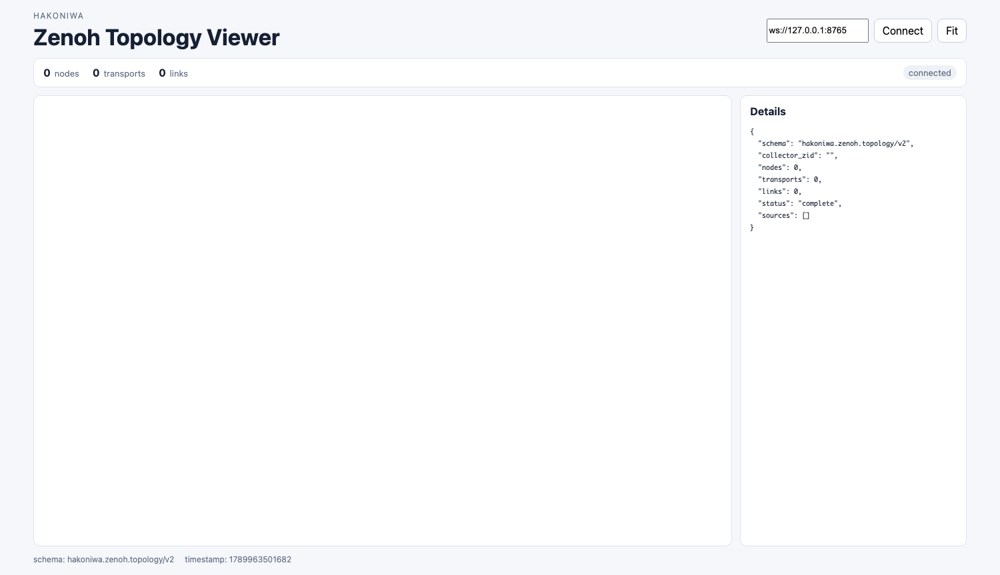

# 06 ブラウザでZenoh接続Topologyを確認する（オプション）

この章では、通常のZenoh演習にHakoniwa Topology Viewerを追加し、
Zenoh sessionのリンク構成をブラウザで確認します。

Topology Viewerはオプション機能です。この章を実施しない場合、従来の
`pub`／`sub`、Docker Compose、Zenoh演習には影響しません。

ホスト側では、次のように両リポジトリを同じ `workspace` の直下へ
配置してください。

```text
workspace/
├── zenoh-tutorial/
└── hakoniwa-business-pack/
```

まだ取得していない場合は、ホストで次を実行します。

```bash
mkdir -p workspace
cd workspace
git clone --recursive https://github.com/tmori/zenoh-tutorial.git
git clone https://github.com/hakoniwalab/hakoniwa-business-pack.git
cd zenoh-tutorial
```

事前にcloneするのは、この2リポジトリです。`hakoniwa-pdu-endpoint`、
`hakoniwa-pdu-bridge-core`、`hakoniwa-pdu-python`、
`hakoniwa-pdu-registry`、`hakoniwa-pdu-javascript`、
`hakoniwa-zenoh-topology-viewer`は、後述のBusiness Packの`configure`が
`workspace`直下へcloneします。

## 1. Viewerで確認できること

ブラウザには次の情報が表示されます。

- Zenohノード
- 各ノードが持つtransport
- ノード間の重複を除いたリンク
- 各Topology Agentの状態
- Agent停止時の `stale` 状態

データは次の経路でブラウザへ届きます。

```text
Zenoh pub/sub session
        |
        v
Topology Agent
        |
        v
Hakoniwa PDU Endpoint multiplexer
        |
        v
Aggregator -> Bridge -> WebSocket -> Browser
```

## 2. Docker環境を起動する

ホストの `workspace/zenoh-tutorial` ディレクトリで実行します。

WSL2／Ubuntu:

```bash
docker compose \
  -f docker-compose.yml \
  -f docker-compose.viewer.yml \
  up -d --build
```

Apple Silicon Mac:

```bash
docker compose \
  -f docker-compose.yml \
  -f docker-compose.viewer.yml \
  -f docker-compose.mac.yml \
  up -d --build
```

## 3. Viewer環境を準備する

`node_a` に入り、Hakoniwa Business PackのRecipeを使って必要な
Foundationを構築します。

`doctor`で現在の状態を確認し、`plan`でclone／build予定を確認した後、
`configure`で依存リポジトリの取得、Foundationの構築、Recipe runtimeの生成を
行います。第1章で作成した`zenoh-c`のRustビルド成果物は再利用され、Foundation用の
install prefixへインストールされます。

```bash
docker compose exec node_a bash
cd /root/workspace/hakoniwa-business-pack

python3 tools/recipe.py doctor \
  --recipe recipes/examples/zenoh-tutorial-topology-viewer.yaml
python3 tools/recipe.py plan \
  --recipe recipes/examples/zenoh-tutorial-topology-viewer.yaml
python3 tools/recipe.py configure \
  --recipe recipes/examples/zenoh-tutorial-topology-viewer.yaml
```

Viewer対応版のCサンプルをビルドします。

```bash
cd /root/workspace/zenoh-tutorial/sample/c-sample
./build-viewer.bash
```

通常版の `cmake-build/pub` と `cmake-build/sub` は変更されません。
Viewer対応版は `cmake-build-viewer` に生成されます。

## 4. Viewerを起動する

`node_a` で起動します。

```bash
cd /root/workspace/hakoniwa-business-pack
python3 tools/recipe.py launch \
  --recipe recipes/examples/zenoh-tutorial-topology-viewer.yaml
```

このLauncherはBridge、Webサーバー、Aggregatorを起動します。
Hakoniwa Coreと `hako-cmd` は使用しません。

ホストのブラウザで <http://localhost:5173> を開き、**Connect**を押します。
この時点では観測対象のZenoh sessionがないため、ノードは表示されません。



接続直後に`connected`、`0 nodes`、`0 links`と表示されれば、Aggregatorから
ブラウザまでの経路は正常です。この後、Viewer対応版のPub/Subを起動すると
ノードと線が追加されます。

## 5. 演習を開始する

以上でViewerのセットアップは完了です。実際に入力するViewer併用版コマンドと、
そのとき表示される実測画面は各演習の手順内に記載しています。

- [第2章: 同一コンテナ内のPub/Sub](02-pub-sub.md)
- [第3章: 同一ネットワーク内の通信](03-network.md)
- [第4章: Zenoh Routerを介した通信](04-router.md)
- [第5章: Regionsによるネットワークの階層化](05-region.md)

通常版だけを試す場合は各手順の通常コマンドを、接続構成も同時に見る場合は
その直後にある「Viewer併用時」のコマンドを実行してください。

## 6. 演習を終了する

ホストの `workspace/zenoh-tutorial` ディレクトリでDocker Compose環境全体を終了します。
Launcherや各プロセスを個別に停止する必要はありません。

WSL2／Ubuntu:

```bash
docker compose \
  -f docker-compose.yml \
  -f docker-compose.viewer.yml \
  down
```

Apple Silicon Mac:

```bash
docker compose \
  -f docker-compose.yml \
  -f docker-compose.viewer.yml \
  -f docker-compose.mac.yml \
  down
```

## 7. 注意点

- `-A <表示名>`または`--topology-agent <表示名>`を指定したときだけTopology Agentが動作します
- Aggregatorが動作していなくても、通常のZenoh pub/sub処理は継続します
- ブラウザ表示は毎秒更新されますが、ノードとリンクに変更がなければ
  グラフ全体を再配置しません
- Viewer対応サンプルを停止して5秒以上経過すると、そのAgentは`stale`表示になり、
  同じコマンドを再実行すると新しいsessionへ更新されます
- 同じ表示名を複数のsessionへ指定しても内部ではZIDで区別され、Viewerが
  短縮ZIDをラベルへ補います

## 8. 図とDetailsの読み方

丸やひし形、線、`tcp` ラベル、件数、クリック時に表示される
Detailsの各フィールドについては、次のガイドを参照してください。

- [Zenoh Topology Viewerの見方](https://github.com/hakoniwalab/hakoniwa-zenoh-topology-viewer/blob/main/docs/viewer-guide.md)

線はノード間の接続関係を表し、方向を持ちません。PublisherからSubscriberへの
データ配送方向やclient／serverの関係は表しません。実際にそのlinkを観測した
Agentは、Detailsの `raw.observed_by` で確認できます。

講義資料用PNGの対応する演習と更新方法は、
[Topology Viewer画像の更新手順](maintenance/viewer-screenshots.md)にまとめています。
